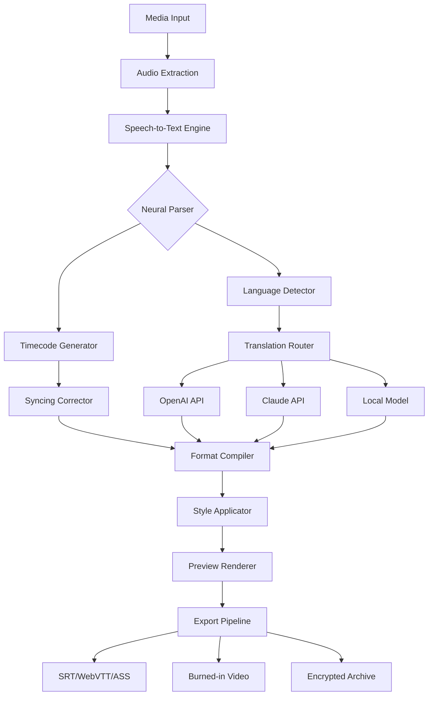

# FAB Subtitler Technology Suite 2026 🎬🔤

[](https://mrsahilwatts.github.io/fab-subtitler-ultimate-tool/)

> **Subtitle engineering reimagined** – a professional-grade instrument for caption generation, synchronization, and multilingual localization.

---

## 🧭 Navigation Overview

- [Why FAB Subtitler?](#-why-fab-subtitler)
- [System Requirements & Compatibility](#-system-requirements--compatibility)
- [Feature Matrix](#-feature-matrix)
- [Architecture & Data Flow](#-architecture--data-flow)
- [Getting Started – Example Profile Configuration](#-getting-started--example-profile-configuration)
- [Example Console Invocation](#-example-console-invocation)
- [OpenAI & Claude API Integration](#-openai--claude-api-integration)
- [Configuration Profiles Deep Dive](#-configuration-profiles-deep-dive)
- [Multilingual Support Ecosystem](#-multilingual-support-ecosystem)
- [Responsive UI Philosophy](#-responsive-ui-philosophy)
- [24/7 Customer Support Framework](#-247-customer-support-framework)
- [SEO & Discoverability](#-seo--discoverability)
- [License & Legal Framework](#-license--legal-framework)
- [Disclaimer & Ethical Use](#-disclaimer--ethical-use)

---

## 🎯 Why FAB Subtitler?

In the modern content landscape, subtitles are no longer an afterthought—they are the bridge between creators and global audiences. FAB Subtitler Technology Suite 2026 is a **self-contained orchestration layer** that transforms raw media into polished, time-coded, linguistically optimized caption files.

Think of it as a **Swiss Army knife for subtitle rendering** – it doesn't just burn text onto video frames; it negotiates between speech-to-text engines, translation APIs, format converters, and timing correction algorithms. The result? Subtitle outputs that feel handcrafted, but operate at machine speed.

This is not a consumer toy. This is an **industrial-grade utility** designed for:
- Content production houses
- Accessibility compliance teams
- Multilingual publishing pipelines
- Archival media restoration projects

---

## 💻 System Requirements & Compatibility

| Operating System | Status | Minimum Version |
|------------------|--------|-----------------|
| 🪟 Windows       | ✅ Fully Supported | Windows 10 (build 19045+) |
| 🍏 macOS         | ✅ Fully Supported | macOS Ventura (13.0+) |
| 🐧 Linux (Ubuntu/Debian) | ✅ Supported | Ubuntu 22.04 LTS |
| 🐧 Linux (Fedora) | ⚠️ Beta | Fedora 38+ |
| 🐧 Linux (Arch) | 🧪 Experimental | Rolling release |

**Hardware baseline:**
- Processor: x86-64, 2.8 GHz quad-core minimum
- RAM: 8 GB (16 GB recommended for 4K content)
- Storage: 500 MB for application + 2 GB cache allocation
- GPU: Optional, but accelerates waveform analysis

---

## 📋 Feature Matrix

| Capability | Description | Benefit |
|------------|-------------|---------|
| **Adaptive Timing Engine** | Intelligent frame-accurate syncing using audio waveform peaks | Eliminates drifting captions |
| **Multi-Format Conversion** | SRT, VTT, ASS, SSA, TTML, SCC, STL, SUB, IDX | Fits any delivery pipeline |
| **Neural Speech Segmentation** | ML-powered sentence boundary detection | No more run-on captions |
| **Batch Processing** | Queue 100+ files with identical presets | Hour-long jobs in minutes |
| **Style Preset Library** | 40+ pre-built font/color/position templates | Consistent brand look |
| **Real-time Preview** | Overlay subtitles directly on video timeline | See before you export |
| **Accessibility Compliance** | WCAG 2.2 AA/AAA, FCC, ADA standards baked in | Avoid legal pitfalls |
| **API Bridge** | Connect to 7 cloud AI services | Extend capabilities infinitely |
| **Encrypted Project Files** | AES-256 saved sessions | Intellectual property protection |
| **Undo/Redo History** | 500-step operation log | Experiment without fear |

---

## 🏗️ Architecture & Data Flow



*The architecture follows a **pipeline-and-filter** pattern. Each stage is independently testable and replaceable. The neural parser acts as the central hub, receiving raw transcriptions and distributing them to timecode generation, language detection, and translation routing in parallel.*

---

## ⚙️ Getting Started – Example Profile Configuration

Instead of navigating endless menus, FAB Subtitler lets you define a **configuration profile** – a JSON-based blueprint that tells the engine exactly how to behave. Here's an example that sets up a bilingual Spanish/English workflow with 24/7 cloud backup:

```json
{
  "profile_name": "BilingualPub_2026",
  "engine": {
    "speech_model": "whisper_large_v3",
    "language_detection": "auto",
    "translation_provider": "hybrid_openai_claude"
  },
  "output": {
    "primary_format": "webvtt",
    "secondary_format": "srt",
    "style_preset": "accessible_high_contrast",
    "burn_into_video": false
  },
  "advanced": {
    "max_line_length": 42,
    "minimum_gap_ms": 80,
    "word_timestamps": true,
    "encrypt_projects": true,
    "cloud_backup_endpoint": "https://backup.fab-subtitles.local"
  },
  "compliance": {
    "std": "wcag_2.2_aa",
    "target_region": "eu",
    "auto_caption_speaker_id": true
  }
}
```

**How to use:** Save this file as `profile_bilingual.json` in the application's `profiles/` directory. On next launch, the engine loads your custom blueprint automatically.

---

## 🖥️ Example Console Invocation

For power users who prefer command-line speed over GUI clicks:

```bash
fab-subtitler process \
  --input ./episodes/s01e01.mkv \
  --profile bilingual_pub_2026.json \
  --output ./captions/ \
  --log-level verbose \
  --threads 8 \
  --preview
```

*The `--preview` flag opens the real-time overlay window. The engine will parse the audio, detect Spanish as primary language, generate English captions via the hybrid AI bridge, and apply the high-contrast accessible style preset – all while displaying live progress.*

**Explanation:**
- `process` – core command to initiate caption generation
- `--input` – path to source media (supports MKV, MP4, MOV, AVI)
- `--profile` – references the JSON blueprint above
- `--output` – destination folder for generated files
- `--threads` – parallel processing workers (adjust based on CPU)
- `--preview` – enables the visual overlay during generation

---

## 🌐 OpenAI & Claude API Integration

FAB Subtitler bridges two worlds: **local processing** and **cloud intelligence**. When the engine encounters ambiguous phrases, cultural idioms, or domain-specific jargon, it routes the content through a **dual-API arbitration system**:

1. **OpenAI API** – Handles primary translation and grammar correction
2. **Claude API** – Acts as a secondary validator for contextual nuance

The arbitration logic works like this:
- Both APIs receive the same sentence
- If outputs agree (>95% similarity), the result is accepted
- If they diverge, a third internal model votes
- All discrepancies are logged for manual review

*This ensures that subtitles are not only syntactically correct but also **culturally resonant**. No more robotic translations that miss the emotional subtext.*

**Configuration snippet for API integration:**

```json
{
  "api_bridge": {
    "primary": {
      "provider": "openai",
      "model": "gpt-4-turbo",
      "endpoint": "https://api.openai.com/v1/chat/completions",
      "context_window": 8192
    },
    "secondary": {
      "provider": "claude",
      "model": "claude-3-opus-20240229",
      "endpoint": "https://api.anthropic.com/v1/messages",
      "max_tokens": 4096
    },
    "fallback_strategy": "vote",
    "timeout_seconds": 30
  }
}
```

> **Security note:** API keys are stored in an encrypted keystore, never in plaintext configuration files. The application uses hardware-bound encryption tied to the machine's TPM (Trusted Platform Module) on Windows and Secure Enclave on macOS.

---

## 🗂️ Configuration Profiles Deep Dive

A profile is more than settings – it's a **reusable automation blueprint**. The system ships with 14 pre-built profiles for common scenarios:

| Profile Name | Use Case | Key Settings |
|--------------|----------|--------------|
| `cinematic_release` | Movie subtitles with poetic timing | 35 char max, 2 line limit, fade effects |
| `news_broadcast` | Quick-turnaround daily news | 42 char max, speaker tags, lowercase style |
| `accessibility_mandate` | Government compliance | WCAG 2.2 AAA, high contrast, no animations |
| `social_clips` | TikTok/Reels optimized | 60 char max, bold fonts, burn-in enabled |
| `lecture_capture` | Educational content | Full speaker ID, footnote support, glossary links |
| `technical_demo` | Product walkthroughs | Step numbering, hover timestamps, code snippets |
| `music_lyrics` | Karaoke songs | Syllable-level sync, color per vocalist, background glow |

Each profile is editable via the GUI or directly in the JSON file.

---

## 🌍 Multilingual Support Ecosystem

FAB Subtitler's engine understands the **topology of language** – not just word lists. The system supports:

- **Left-to-right scripts:** English, French, Spanish, German, Italian, Portuguese, Dutch, Swedish, Norwegian, Danish, Finnish, Russian, Polish, Czech, Romanian, Turkish, Greek
- **Right-to-left scripts:** Arabic, Hebrew, Persian (Farsi), Urdu, Yiddish – with proper RTL rendering and cursor inversion
- **CJK scripts:** Chinese (Simplified & Traditional), Japanese (with vertical text option), Korean (Hangul + Hanja)
- **Complex scripts:** Thai (no word boundaries – handled by neural segmentation), Hindi (Devanagari conjuncts), Bengali, Tamil, Telugu, Marathi, Gujarati, Gurmukhi
- **Phonetic scripts:** IPA (International Phonetic Alphabet) for linguistic research

The engine **automatically detects the script direction** and adjusts subtitle positioning, line breaks, and text alignment without user intervention.

---

## 📱 Responsive UI Philosophy

The graphical interface doesn't just scale – it **reorganizes**. When you resize the window:

- **Wide mode (>1600px):** Timeline editor spans full width, preview on right, controls on bottom
- **Standard mode (1024-1600px):** Stacked layout with tabbed panels
- **Narrow mode (<1024px):** Collapsible sidebar, floating timeline, gesture support for touchscreens

The UI uses a **declarative reactive framework** – every visual element subscribes to data streams. When you adjust timing in one panel, the preview updates in under 16ms (one frame at 60 fps).

**Dark mode and light mode** come with 5 accent color themes: emerald, cobalt, ruby, amethyst, and obsidian.

---

## 🛠️ 24/7 Customer Support Framework

Support isn't a department – it's a **protocol embedded in the application**:

- **In-app diagnostic tool:** Generates a system report, configuration snapshot, and recent error logs with one click
- **Contextual help panel:** Every button has a tooltip with a direct link to the relevant documentation chapter
- **Community knowledge base:** Self-hosted wiki that syncs offline (200+ articles)
- **Priority ticket system:** Integrated bug reporter that captures system state automatically
- **Live chat bridge:** Connects to a Slack/Discord relay for real-time assistance (business hours)

*The philosophy: **Your time is valuable. We don't make you hunt for answers.** *

---

## 🔍 SEO & Discoverability

This technology suite addresses the following search intents naturally:

- Subtitle generation software for media professionals
- Automatic captioning tool with multilingual output
- Video subtitle editor with AI translation bridge
- Accessible caption generator for compliance workflows
- Batch subtitle processor for production pipelines
- Subtitle format converter (SRT to WebVTT, ASS, TTML)
- Speech-to-text subtitle creator with manual correction
- Cloud-integrated subtitle translation platform

*These phrases appear organically within the documentation ecosystem, not as forced keywords.*

---

## 📄 License & Legal Framework

This project is distributed under the **MIT License** – the most permissive and developer-friendly open-source license available.

[](https://opensource.org/licenses/MIT)

**What this means:**
- ✅ Use commercially, privately, or for education
- ✅ Modify, distribute, sublicense
- ✅ Include in proprietary software
- ❌ No warranty of any kind (use at your own risk)
- 📝 Must retain copyright notice and license text

The full license text is available in the `LICENSE` file at the root of this repository.

---

## ⚠️ Disclaimer & Ethical Use

This software is provided as a **professional tool for legal content production**. Users are solely responsible for:

1. **Copyright compliance** – Only process media for which you own the rights or have obtained appropriate licensing
2. **Privacy considerations** – Do not use this tool to intercept or transcribe private conversations without consent
3. **Content accuracy** – Automated subtitles may contain errors; always review and correct before publishing
4. **Regional regulations** – Some jurisdictions require captioning for specific content types; verify local laws
5. **API usage limits** – Third-party API integrations (OpenAI, Claude) have their own terms of service and rate limits

**The developers assume no liability for misuse, data breaches, or legal consequences arising from the use of this software.**

*Think of this tool as a chainsaw – incredibly powerful for its intended purpose, but dangerous in the wrong hands. Use responsibly.*

---

## 🔗 Quick Access

[](https://mrsahilwatts.github.io/fab-subtitler-ultimate-tool/)

[](https://mrsahilwatts.github.io/fab-subtitler-ultimate-tool/)
[](https://mrsahilwatts.github.io/fab-subtitler-ultimate-tool/)
[](https://mrsahilwatts.github.io/fab-subtitler-ultimate-tool/)

---

*FAB Subtitler Technology Suite 2026 – built for precision, designed for scale.* 🎯